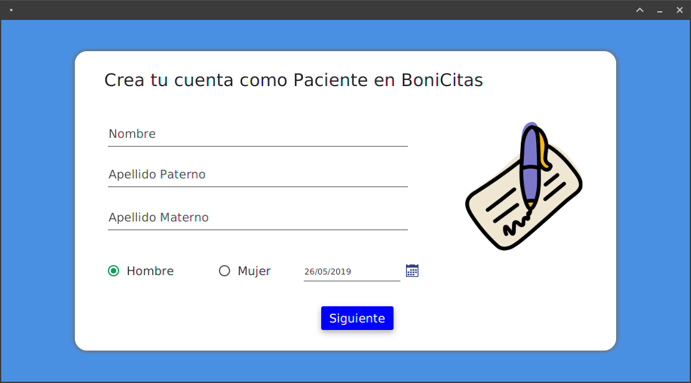
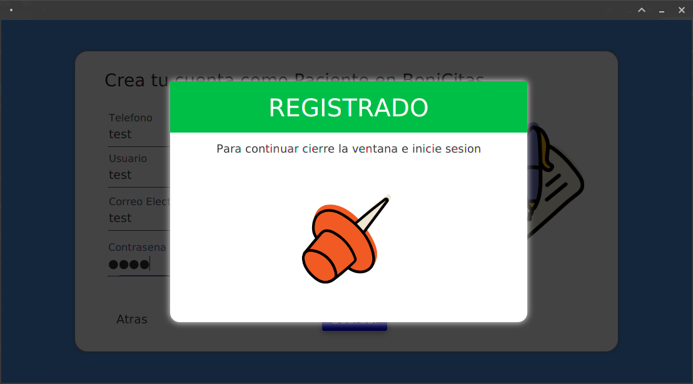
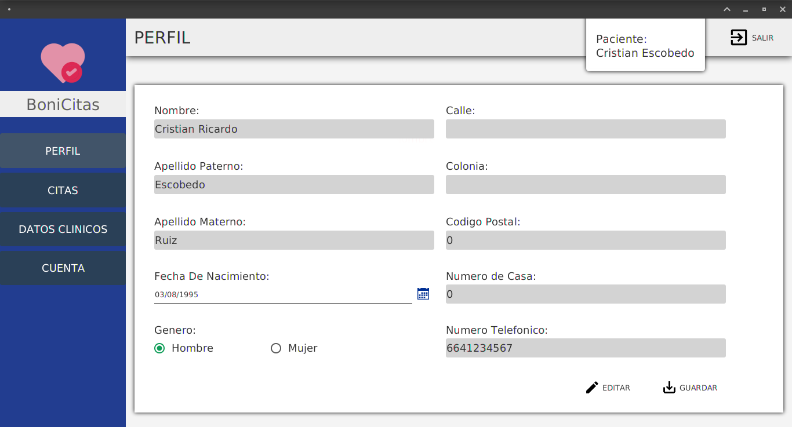

BoniCitas
=========================
**Description:** Sistema de citas medicas.

**License:** GNU General Public License v3.0

**Source code:** https://github.com/OrigenData/BoniCitas	

###### Screenshot

###### Nota
***Es necesario tener java 10.***

### Dependencies (Test on Fedora 28)

* En el archivo build.gradle estan las dependencias necesarias
